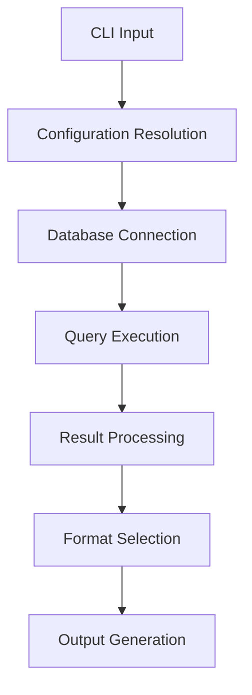
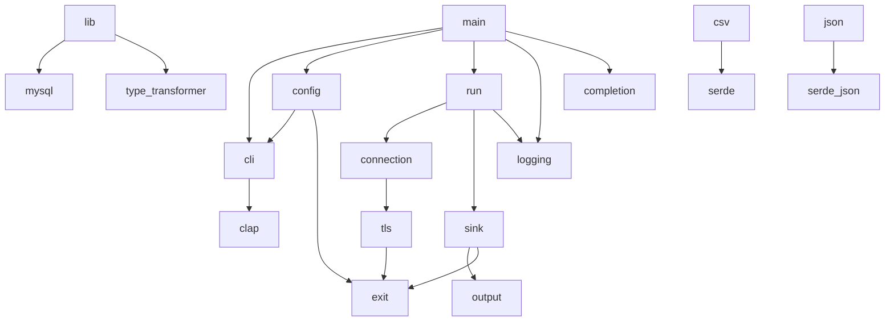

# Architecture

Gold Digger's architecture and design decisions.

## High-Level Architecture

## Core Components

### CLI Layer (`main.rs`, `cli.rs`, `config.rs`, `completion.rs`)

- Argument parsing with clap
- `Cli` struct parsed once and projected into `ResolvedConfig` at the binary boundary
- Downstream code only consumes `&ResolvedConfig`, never re-accesses `Cli`
- Configuration validation via `ResolvedConfig::from_cli`
- Environment variable fallback through `EnvSnapshot` (captured once at startup)
- Shell completion generation

### Database Layer (`lib.rs`, `connection.rs`, `run.rs`, `sink.rs`)

- MySQL connection management via `connection.rs`
- Connection pool creation with TLS configuration
- Query execution and streaming result processing via `run.rs`
- `RowSink` trait for format-specific streaming output (CSV, JSON, TSV)
- Atomic output via `<output>.tmp` write and rename on success
- Delegates value conversion to TypeTransformer

### Type Conversion (`type_transformer.rs`)

- Canonical hub for safe MySQL value conversion
- Panic-free conversion of `mysql::Value` to `String` and `serde_json::Value`
- Key methods: `value_to_string`, `value_to_json`, `row_to_strings`, `row_to_json`
- Safety guarantees: NULL handling, invalid UTF-8 hex encoding, special float handling (NaN, Infinity), date/time validation
- Exported as public API via `lib.rs`

### Logging & Observability (`logging.rs`)

- Structured logging via `tracing` + `tracing-subscriber`
- Credential redaction via `utils::redact_sql_error` before reaching subscriber
- Colored `[DANGER]` and `[WARNING]` banners (respects `NO_COLOR` and TTY detection)
- Progress indicators via `indicatif` for connect/query/write phases

### Output Layer (`csv.rs`, `json.rs`, `tab.rs`, `delimited.rs`, `output.rs`)

- Format-specific serialization
- Streaming output via `sink.rs` implementations
- Consistent interface design
- Type-safe conversions
- Atomic file operations with path safety guards

## Design Principles

### Security First

- Automatic credential redaction
- TLS/SSL by default
- Input validation and sanitization

### Type Safety

- Rust's ownership system prevents memory errors
- Explicit NULL handling
- Safe type conversions via TypeTransformer
- Comprehensive snapshot testing for conversion edge cases

### Performance

- Connection pooling
- Efficient serialization
- Minimal memory allocations

## Key Design Decisions

### Memory Model

- **Streaming**: Result rows are processed one at a time via `conn.query_iter`
- **Rationale**: Prevents memory exhaustion on large datasets
- **Implementation**: `RowSink` trait in `src/sink.rs` feeds rows through format-specific writers
- **Output Safety**: Written to `<path>.tmp` and atomically renamed on success to prevent partial output files
- **Memory Profile**: Peak memory is O(1 row), not O(N rows)

### Error Handling

- **Pattern**: Typed `GoldDiggerError` enum with downcast-based classification
- **Core Variants**: `NoRows`, `Config`, `DbAuth`, `Query`, `Io`
- **Domain-Specific Errors**: `ConfigError` and `TlsError` typed enums for granular error categorization
- **Exit Code Mapping**: Typed errors map to stable exit codes 0-5 via `GoldDiggerError::exit_code()`
- **Legacy Path**: Substring matching on error text remains as fallback for untyped `anyhow` errors (being phased out)
- **Benefits**: Exit codes stable across message refactors; richer error context for operators

### Configuration Precedence

- **Order**: CLI flags > Environment variables > error
- **Implementation**: `ResolvedConfig::from_cli` runs once at startup in `src/main.rs`
- **Environment Snapshot**: `EnvSnapshot::from_process_env` captures env vars once to prevent concurrent mutation issues
- **Validation**: Front-loaded at config resolution time; downstream code receives fully-validated `&ResolvedConfig`
- **Error Mapping**: Config resolution errors map to exit code 2 via `GoldDiggerError::Config(ConfigError::*)`
- **Rationale**: Explicit overrides implicit; predictable behavior in automation

## Module Dependencies

**Note**: The diagram above reflects the new module structure post-refactor. `tls/` is now a directory with `mod`, `error`, `classifier`, `config`, `ca`, and `pool` submodules.

## Future Architecture

### Planned Improvements

- Plugin system for custom formats
- Configuration file support
- Async/await for better concurrency
